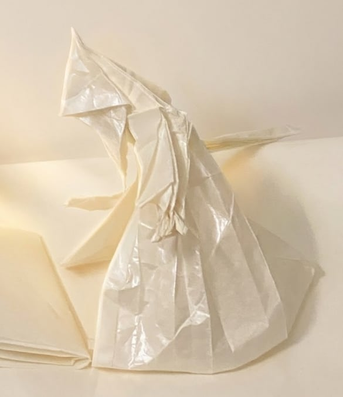

> *"The pursuit of beauty is merely a way of keeping alive a part of ourselves that would otherwise die of neglect."*

I've always been drawn to the beauty of things — not just what they are, but how they're made. The way a line curves, the way paper folds, the way a melody resolves. There's something deeply satisfying about structure revealing itself through form.

Over the years, I've dabbled in different crafts. Not to become great at any of them, but simply because I couldn't resist trying.

---

## Music

I used to play **fingerstyle guitar**, mostly self-taught. Learned by ear, figured things out on my own. But after my first year of university, I stopped — and haven't picked it up since.

Before I quit, I recorded a cover of **"Jump Off" by Jiazhuo Liu**, learned entirely by ear. No tabs, no tutorials — just slow, obsessive listening.

<iframe width="560" height="315" 
    src="https://www.youtube.com/embed/xgSTNfNG4bw" 
    title="Jump Off" 
    frameborder="0" 
    allow="accelerometer; autoplay; clipboard-write; encrypted-media; gyroscope; picture-in-picture" 
    allowfullscreen>
</iframe>

I'm still proud of it. Not because it's flawless, but because it represents effort, patience, and love for sound.

---

## Origami

Most art forms are either *additive* — like painting or music, where you build up layers — or *subtractive*, like sculpture, where you carve away. But origami is different. It's *transformative*. You start with a single sheet, and through folding alone, it becomes something entirely new. Nothing added, nothing removed — just transformed.

There's something meditative about it. No tools, no undo button — just patience and precision. A single sheet becomes something alive.

*Wizard (Satoshi Kamiya) folded 30/11/2025*

---

## Design

I like designing things that feel balanced — visually clear, emotionally resonant. No formal training, just intuition and iteration.

This blog is considered the current state-of-the-art of my design skill.

---

## Drawing

I got curious about drawing recently — spent around 14 hours on it (yes, I counted). Still a total beginner, but I love how lines and shapes can capture something real with so little.

*Just a bird*

*Random scene?*

---

## Now

Sadly, I don't have time for these things anymore. Life got busier, priorities shifted.

These days, I'm more focused on **math** and **coding** — which, honestly, I also consider art forms. There's beauty in a clean proof, elegance in well-structured code. It's a different kind of creativity, but it suits me better right now.

Maybe one day I'll return to paper and strings. But for now, my canvas is the terminal, and my brush is logic.

---

*This page is a quiet archive of the things I once tried to create — not to show skill, but to remember what it felt like to explore.*

